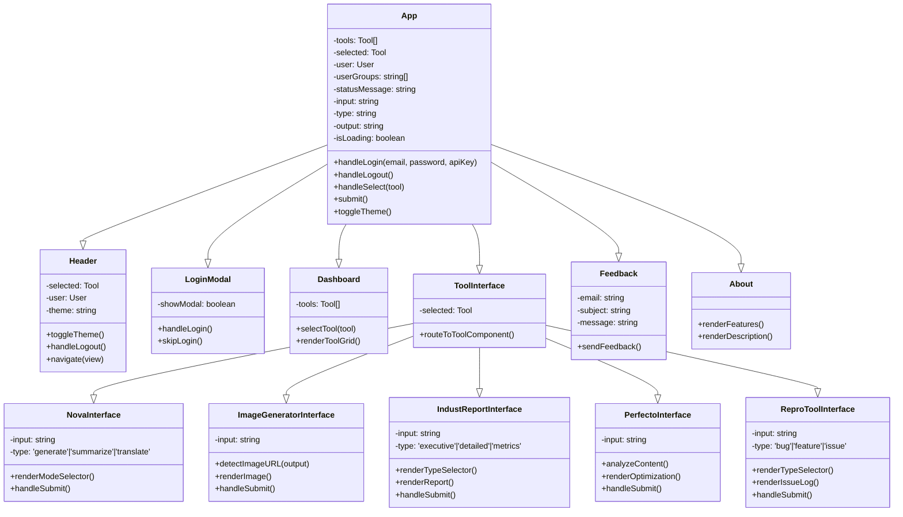
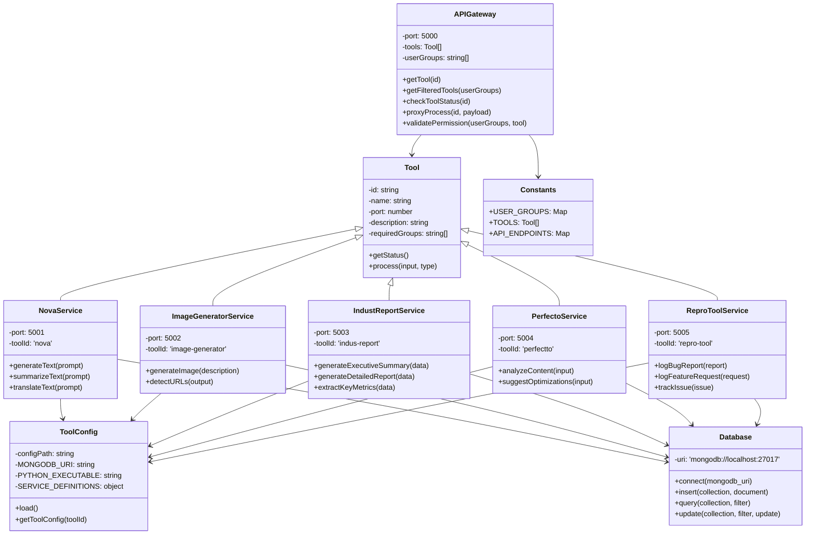
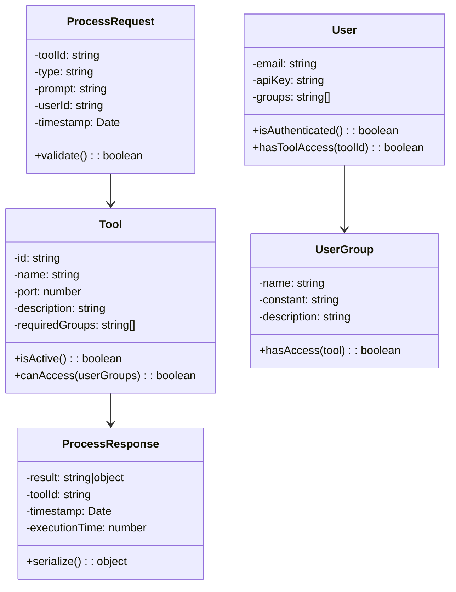
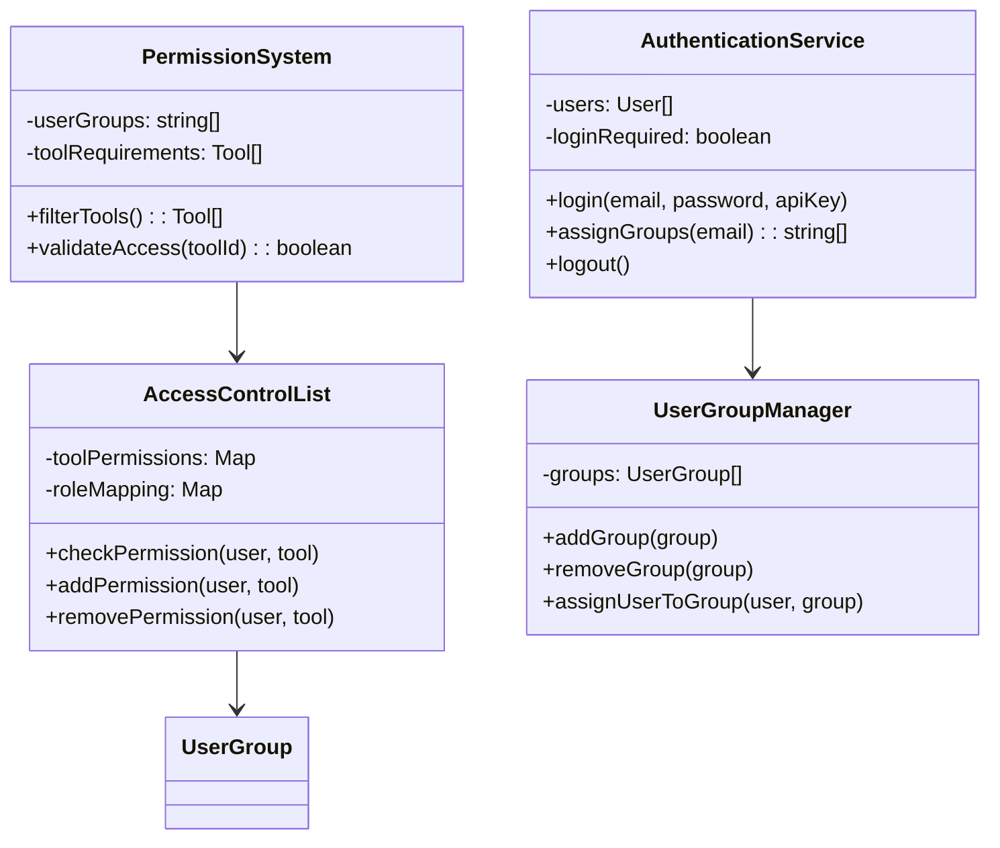
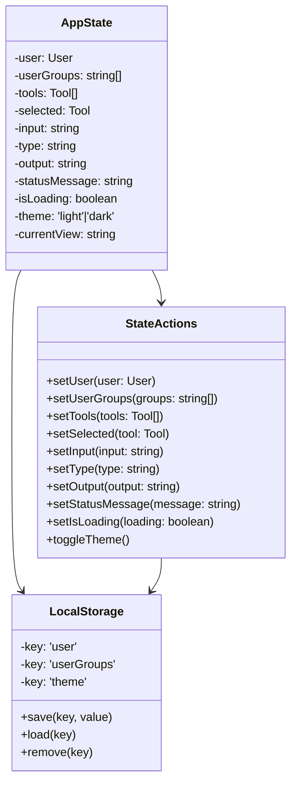

# Component & Class Architecture - TDA AI NEXUS

## Frontend Component Hierarchy

```mermaid
classDiagram
    class App {
        -tools: Tool[]
        -selected: Tool
        -user: User
        -userGroups: string[]
        -statusMessage: string
        -input: string
        -type: string
        -output: string
        -isLoading: boolean
        +handleLogin(email, password, apiKey)
        +handleLogout()
        +handleSelect(tool)
        +submit()
        +toggleTheme()
    }

    class Header {
        -selected: Tool
        -user: User
        -theme: string
        +toggleTheme()
        +handleLogout()
        +navigate(view)
    }

    class LoginModal {
        -showModal: boolean
        +handleLogin()
        +skipLogin()
    }

    class Dashboard {
        -tools: Tool[]
        +selectTool(tool)
        +renderToolGrid()
    }

    class ToolInterface {
        -selected: Tool
        +routeToToolComponent()
    }

    class NovaInterface {
        -input: string
        -type: 'generate'|'summarize'|'translate'
        +renderModeSelector()
        +handleSubmit()
    }

    class ImageGeneratorInterface {
        -input: string
        +detectImageURL(output)
        +renderImage()
        +handleSubmit()
    }

    class IndustReportInterface {
        -input: string
        -type: 'executive'|'detailed'|'metrics'
        +renderTypeSelector()
        +renderReport()
        +handleSubmit()
    }

    class PerfectoInterface {
        -input: string
        +analyzeContent()
        +renderOptimization()
        +handleSubmit()
    }

    class ReproToolInterface {
        -input: string
        -type: 'bug'|'feature'|'issue'
        +renderTypeSelector()
        +renderIssueLog()
        +handleSubmit()
    }

    class Feedback {
        -email: string
        -subject: string
        -message: string
        +sendFeedback()
    }

    class About {
        +renderFeatures()
        +renderDescription()
    }

    App --|> Header
    App --|> LoginModal
    App --|> Dashboard
    App --|> ToolInterface
    App --|> Feedback
    App --|> About

    ToolInterface --|> NovaInterface
    ToolInterface --|> ImageGeneratorInterface
    ToolInterface --|> IndustReportInterface
    ToolInterface --|> PerfectoInterface
    ToolInterface --|> ReproToolInterface
```

## Backend Architecture

```mermaid
classDiagram
    class APIGateway {
        -port: 5000
        -tools: Tool[]
        -userGroups: string[]
        +getTool(id)
        +getFilteredTools(userGroups)
        +checkToolStatus(id)
        +proxyProcess(id, payload)
        +validatePermission(userGroups, tool)
    }

    class Tool {
        -id: string
        -name: string
        -port: number
        -description: string
        -requiredGroups: string[]
        +getStatus()
        +process(input, type)
    }

    class NovaService {
        -port: 5001
        -toolId: 'nova'
        +generateText(prompt)
        +summarizeText(prompt)
        +translateText(prompt)
    }

    class ImageGeneratorService {
        -port: 5002
        -toolId: 'image-generator'
        +generateImage(description)
        +detectURLs(output)
    }

    class IndustReportService {
        -port: 5003
        -toolId: 'indus-report'
        +generateExecutiveSummary(data)
        +generateDetailedReport(data)
        +extractKeyMetrics(data)
    }

    class PerfectoService {
        -port: 5004
        -toolId: 'perfectto'
        +analyzeContent(input)
        +suggestOptimizations(input)
    }

    class ReproToolService {
        -port: 5005
        -toolId: 'repro-tool'
        +logBugReport(report)
        +logFeatureRequest(request)
        +trackIssue(issue)
    }

    class Database {
        -uri: 'mongodb://localhost:27017'
        +connect(mongodb_uri)
        +insert(collection, document)
        +query(collection, filter)
        +update(collection, filter, update)
    }

    class Constants {
        +USER_GROUPS: Map
        +TOOLS: Tool[]
        +API_ENDPOINTS: Map
    }

    class ToolConfig {
        -configPath: string
        -MONGODB_URI: string
        -PYTHON_EXECUTABLE: string
        -SERVICE_DEFINITIONS: object
        +load()
        +getToolConfig(toolId)
    }

    APIGateway --> Constants
    APIGateway --> Tool

    Tool <|-- NovaService
    NovaService --> ToolConfig
    ImageGeneratorService --> ToolConfig
    IndustReportService --> ToolConfig
    PerfectoService --> ToolConfig
    ReproToolService --> ToolConfig
    Tool <|-- ImageGeneratorService
    Tool <|-- IndustReportService
    Tool <|-- PerfectoService
    Tool <|-- ReproToolService

    NovaService --> Database
    ImageGeneratorService --> Database
    IndustReportService --> Database
    PerfectoService --> Database
    ReproToolService --> Database
```

## Data Models

```mermaid
classDiagram
    class User {
        -email: string
        -apiKey: string
        -groups: string[]
        +isAuthenticated(): boolean
        +hasToolAccess(toolId): boolean
    }

    class Tool {
        -id: string
        -name: string
        -port: number
        -description: string
        -requiredGroups: string[]
        +isActive(): boolean
        +canAccess(userGroups): boolean
    }

    class ProcessRequest {
        -toolId: string
        -type: string
        -prompt: string
        -userId: string
        -timestamp: Date
        +validate(): boolean
    }

    class ProcessResponse {
        -result: string|object
        -toolId: string
        -timestamp: Date
        -executionTime: number
        +serialize(): object
    }

    class UserGroup {
        -name: string
        -constant: string
        -description: string
        +hasAccess(tool): boolean
    }

    User --> UserGroup
    ProcessRequest --> Tool
    Tool --> ProcessResponse
```

## Permission & Access Control Flow

```mermaid
classDiagram
    class PermissionSystem {
        -userGroups: string[]
        -toolRequirements: Tool[]
        +filterTools(): Tool[]
        +validateAccess(toolId): boolean
    }

    class AuthenticationService {
        -users: User[]
        -loginRequired: boolean
        +login(email, password, apiKey)
        +assignGroups(email): string[]
        +logout()
    }

    class AccessControlList {
        -toolPermissions: Map
        -roleMapping: Map
        +checkPermission(user, tool)
        +addPermission(user, tool)
        +removePermission(user, tool)
    }

    class UserGroupManager {
        -groups: UserGroup[]
        +addGroup(group)
        +removeGroup(group)
        +assignUserToGroup(user, group)
    }

    PermissionSystem --> AccessControlList
    AuthenticationService --> UserGroupManager
    AccessControlList --> UserGroup
```

## State Management Pattern

```mermaid
classDiagram
    class AppState {
        -user: User
        -userGroups: string[]
        -tools: Tool[]
        -selected: Tool
        -input: string
        -type: string
        -output: string
        -statusMessage: string
        -isLoading: boolean
        -theme: 'light'|'dark'
        -currentView: string
    }

    class StateActions {
        +setUser(user: User)
        +setUserGroups(groups: string[])
        +setTools(tools: Tool[])
        +setSelected(tool: Tool)
        +setInput(input: string)
        +setType(type: string)
        +setOutput(output: string)
        +setStatusMessage(message: string)
        +setIsLoading(loading: boolean)
        +toggleTheme()
    }

    class LocalStorage {
        -key: 'user'
        -key: 'userGroups'
        -key: 'theme'
        +save(key, value)
        +load(key)
        +remove(key)
    }

    AppState --> StateActions
    AppState --> LocalStorage
    StateActions --> LocalStorage
```
