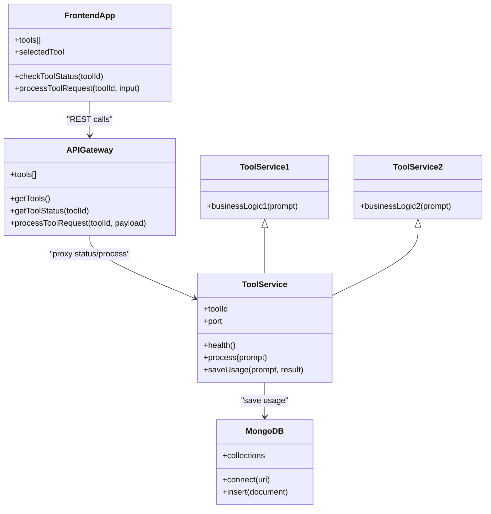

# Class Diagram

```mermaid
classDiagram
    class FrontendApp {
        +tools[]
        +selectedTool
        +checkToolStatus(toolId)
        +processToolRequest(toolId, input)
    }

    class APIGateway {
        +tools[]
        +getTools()
        +getToolStatus(toolId)
        +processToolRequest(toolId, payload)
    }

    class ToolService {
        +toolId
        +port
        +health()
        +process(prompt)
        +saveUsage(prompt, result)
    }

    class MongoDB {
        +collections
        +connect(uri)
        +insert(document)
    }

    FrontendApp --> APIGateway : "REST calls"
    APIGateway --> ToolService : "proxy status/process"
    ToolService --> MongoDB : "save usage"

    class ToolService1 {
        +businessLogic1(prompt)
    }
    class ToolService2 {
        +businessLogic2(prompt)
    }

    ToolService1 <|-- ToolService
    ToolService2 <|-- ToolService

    %% If using unique service classes, model them here; else they share ToolService interface
```
