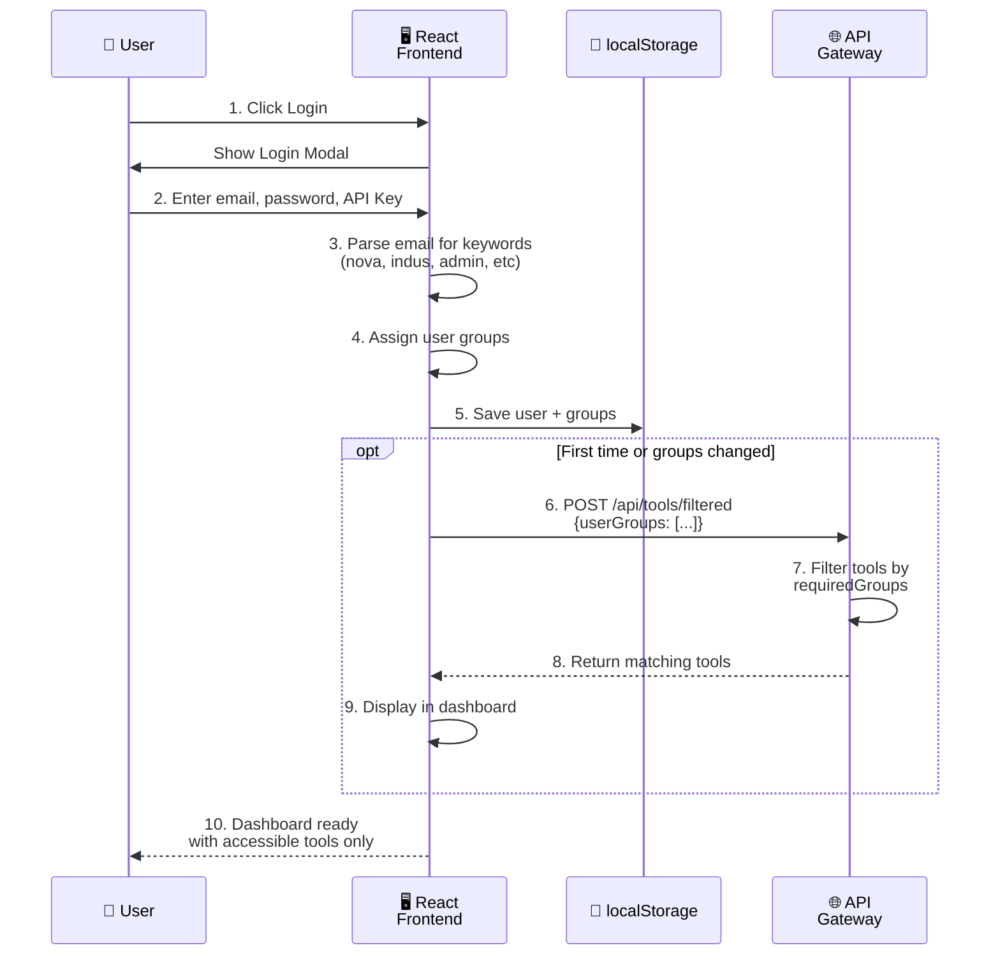
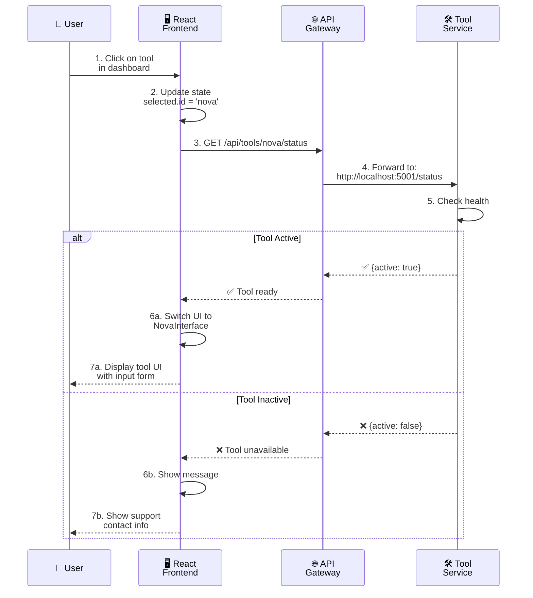
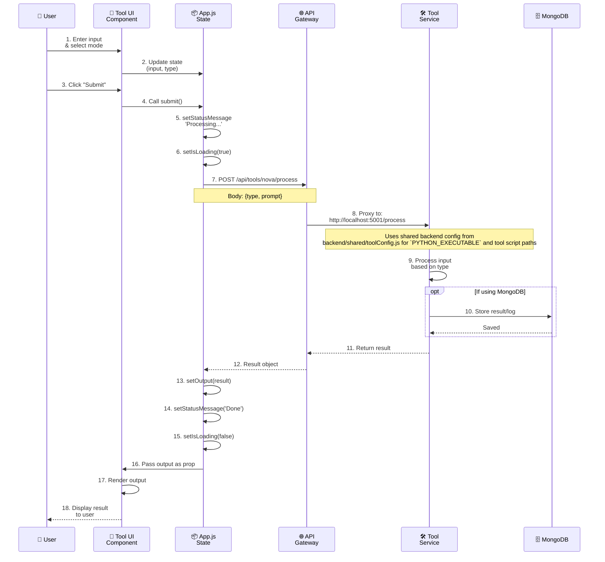
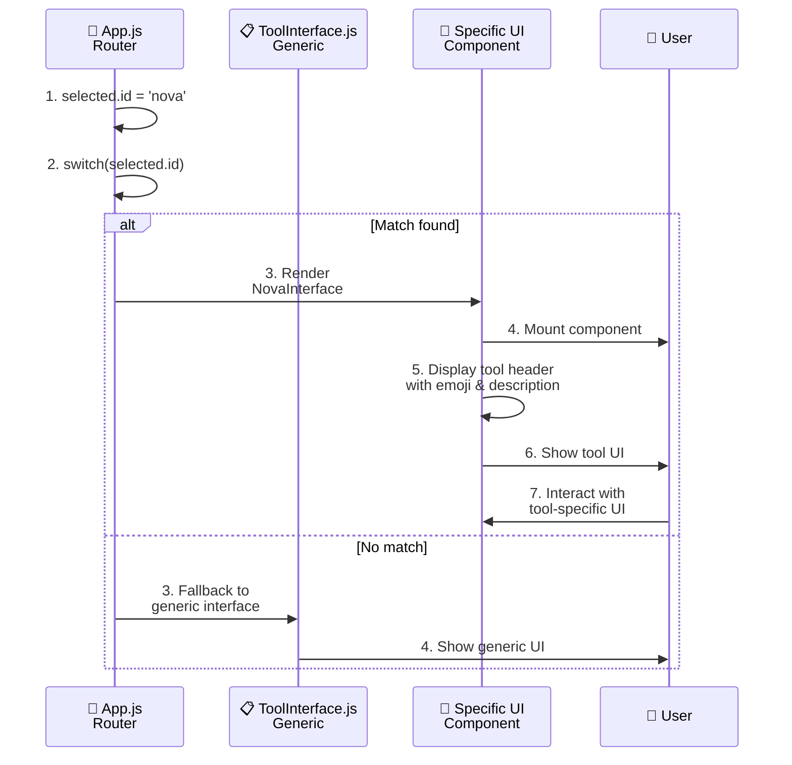
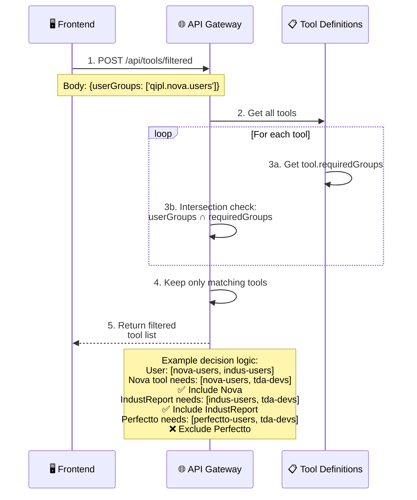
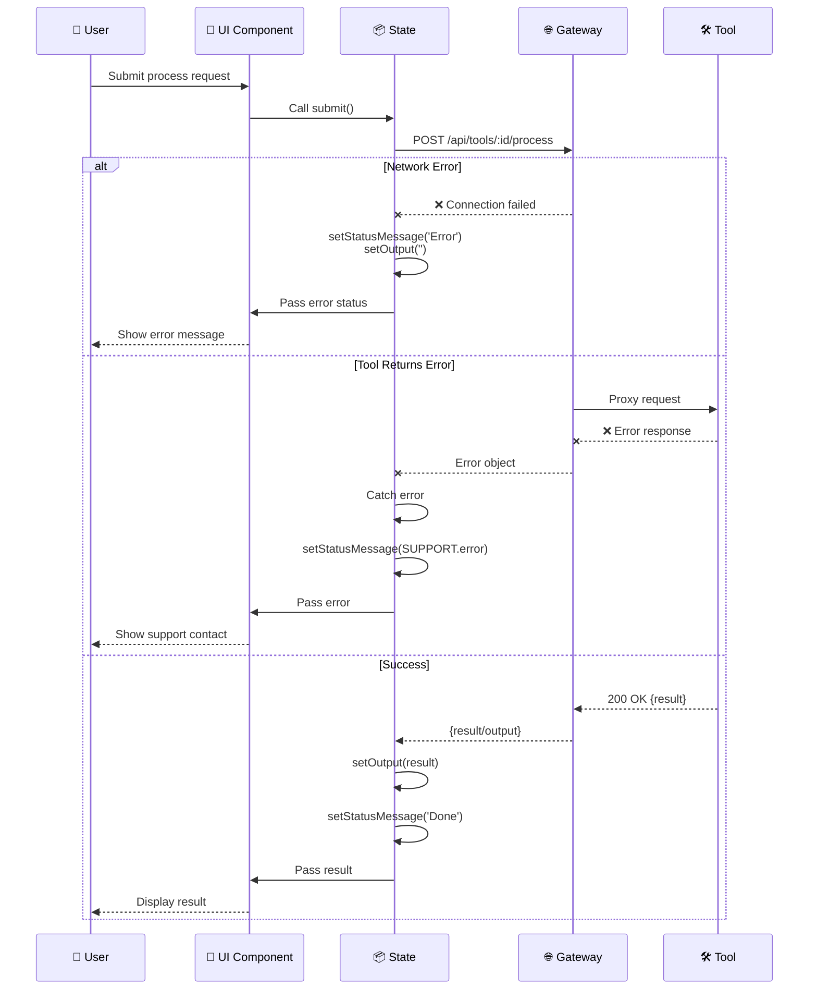

# Sequence Diagrams - TDA AI NEXUS

## 1. User Login & Tool Discovery Flow

## 2. Tool Selection & Status Check

## 3. Tool Processing Flow

## 4. Tool Component Lifecycle

## 5. Permission Filtering Logic

## 6. Error Handling Flow

