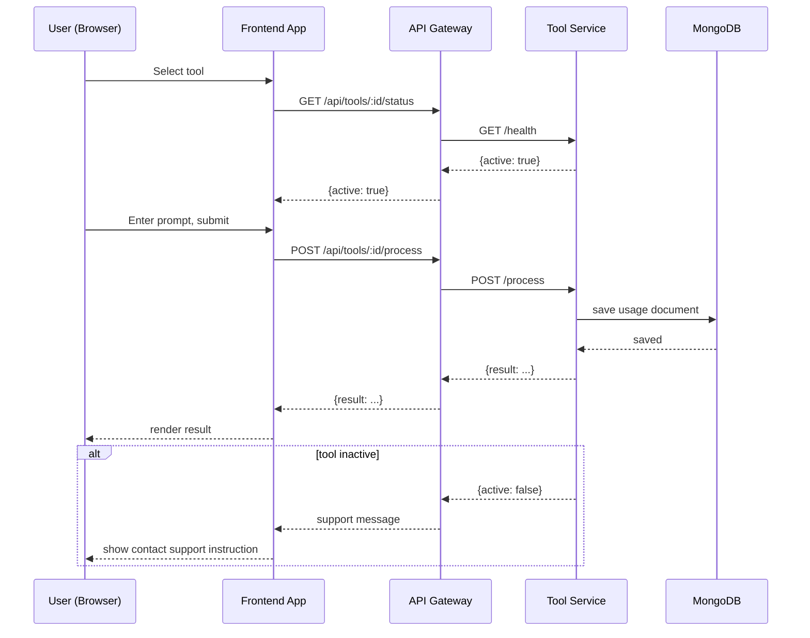

# Sequence Diagram

```mermaid
sequenceDiagram
    participant U as User (Browser)
    participant F as Frontend App
    participant G as API Gateway
    participant T as Tool Service
    participant M as MongoDB

    U->>F: Select tool
    F->>G: GET /api/tools/:id/status
    G->>T: GET /health
    T-->>G: {active: true}
    G-->>F: {active: true}

    U->>F: Enter prompt, submit
    F->>G: POST /api/tools/:id/process
    G->>T: POST /process
    T->>M: save usage document
    M-->>T: saved
    T-->>G: {result: ...}
    G-->>F: {result: ...}
    F-->>U: render result

    alt tool inactive
      T-->>G: {active: false}
      G-->>F: support message
      F-->>U: show contact support instruction
    end
```
