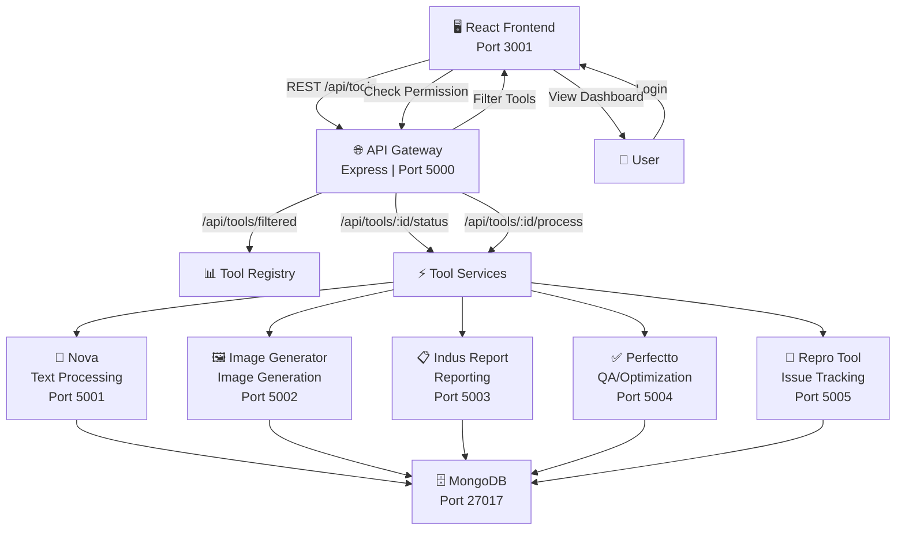
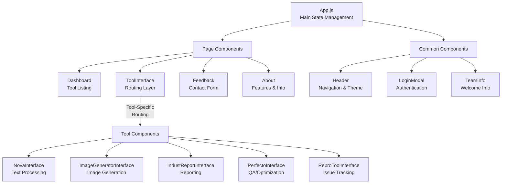
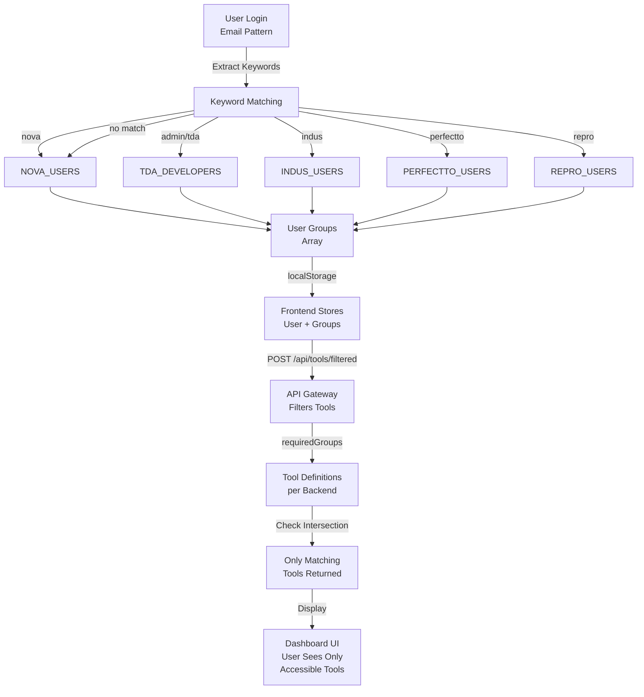
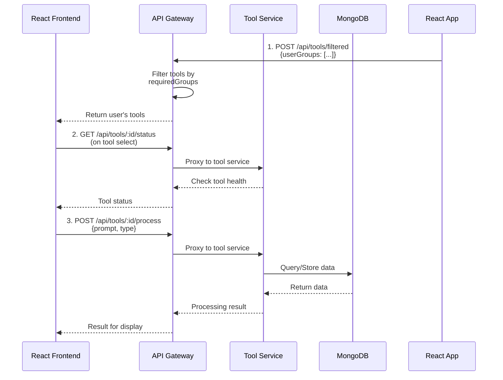
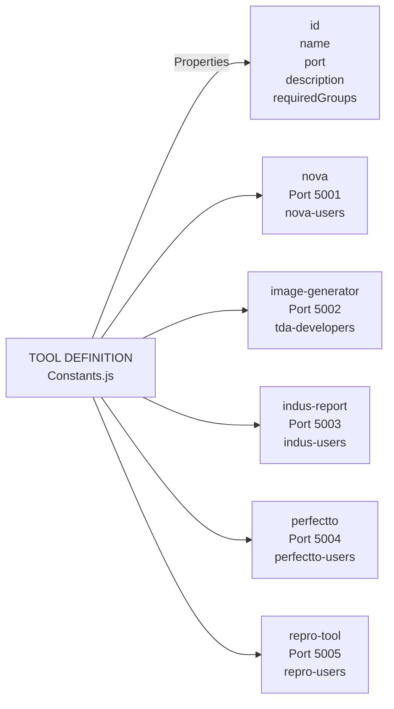
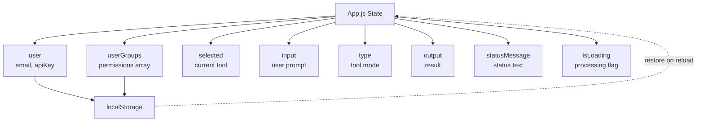
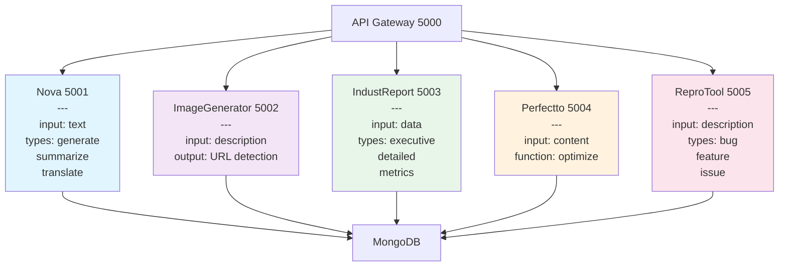
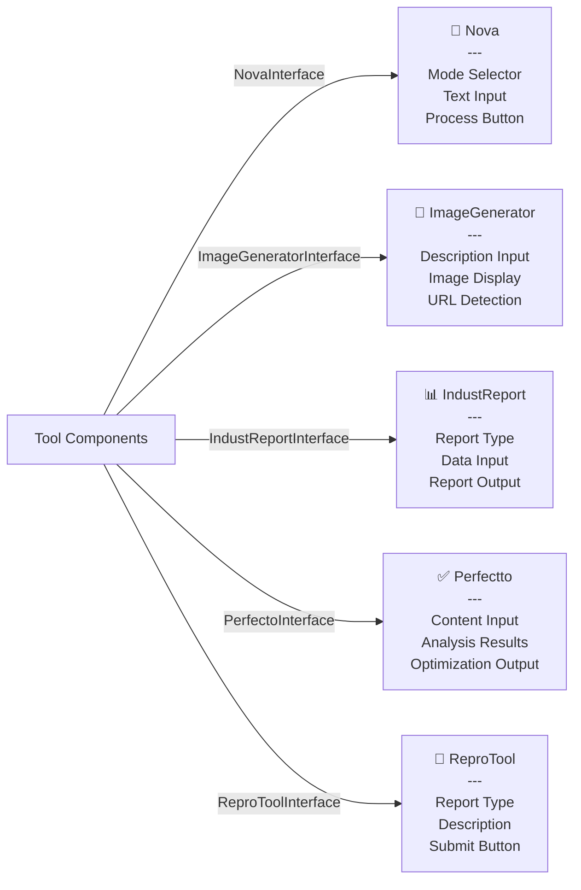

# System Architecture - TDA AI NEXUS

## Overall System Flow

## Frontend Component Architecture

## Backend Authorization & Filtering

## Request/Response Cycle

## Data Model & Tool Definition

## State Management Flow

## Microservice Independence

## Tool-Specific Interfaces

